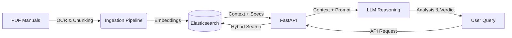

# 🚲 Velo Graph

> **AI-Powered Bicycle Compatibility Engine** > *RAG-система, яка допомагає поєднувати шосейні, гравійні та TT компоненти, не порушуючи законів фізики (та гарантії).*


## 📋 Огляд (Overview)

**Velo Graph** — це інтелектуальна система для перевірки сумісності велосипедних компонентів. Вона вирішує головний біль механіків та триатлетів-аматорів: *"Чи можна поставити цю касету на цей перемикач?"* або *"Чи підійде цей шосейний винос на мою гравійну раму?"*.

На відміну від статичних баз даних, система використовує **RAG (Retrieval-Augmented Generation)**. Вона "читає" офіційні PDF-мануали (Shimano Dealer Manuals, Technical Specs), індексує їх у векторну базу даних і дозволяє LLM відповідати на складні технічні питання, посилаючись на конкретні сторінки документації.

### 🎯 Основний Use Case
Атлет конвертує гравійний велосипед (**Kross Esker 8.0**) у гоночний болід для **IRONMAN 70.3**.
Потрібно перевірити, чи сумісний гравійний перемикач **Shimano GRX RX810** із шосейною касетою **11-28T**, попри те, що офіційна специфікація вимагає мінімум 30T.

---

## 🏗️ Архітектура (Tech Stack)

Проєкт побудований на сучасних принципах Backend-розробки з фокусом на високопродуктивний пошук.

* **Core:** Python 3.14, **FastAPI** (Async).
* **Search Engine & Vector DB:** **Elasticsearch**.
    * Використовується **Hybrid Search**: `Keyword Search` (для точних назв моделей, напр. "RD-R8000") + `kNN Vector Search` (для семантичного пошуку сумісності).
* **AI / LLM:** OpenAI API (GPT-4o) через **LangChain**.
* **ETL / Ingestion:**
    * `Unstructured` / `PyMuPDF` для екстракції тексту та таблиць з PDF.
    * Скрипти для нарізки (chunking) технічної документації.
* **Infrastructure:** Docker & Docker Compose.

### Потік даних (Data Flow)



---

## 🚀 Функціонал

1.  **Semantic Tech Search:** Розуміє запити на природній мові (Natural Language), наприклад: *"Is GRX compatible with road shifters?"*.
2.  **Logic & Constraint Checking:** Аналізує числові обмеження (Capacity, Max/Min Sprocket, Chainline), витягнуті з документації.
3.  **Source Citation:** Кожна відповідь містить посилання на конкретний ID документа ("Dealer Manual page 14"), щоб користувач міг перевірити інформацію.
4.  **"Franken-mode":** Аналіз нестандартних конфігурацій (mullet drivetrains), які офіційно не підтримуються, але фізично можливі.

---

## 🛠️ Встановлення та запуск

### Вимоги
* Docker & Docker Compose
* Python 3.14+
* Poetry (або pip)
* OpenAI API Key (або сумісна локальна модель)

### 1. Клонування репозиторію
```bash
git clone [https://github.com/ohiliazov/velograph.git](https://github.com/ohiliazov/velograph.git)
cd velograph
```

### 2. Налаштування змінних оточення
Створіть файл `.env` на основі прикладу:
```bash
OPENAI_API_KEY=sk-your-key-here
ELASTICSEARCH_URL=http://localhost:9200
ELASTIC_PASSWORD=changeme
```

### 3. Запуск інфраструктури (Elasticsearch + Kibana)
```bash
docker-compose up -d
```

### 4. Встановлення залежностей та запуск API
```bash
poetry install
poetry run uvicorn app.main:app --reload
```
API буде доступне за адресою: `http://localhost:8000/docs`

### 5. (Опціонально) Завантаження бази знань
Щоб система "поумнішала", потрібно завантажити мануали:
```bash
python scripts/ingest.py --source "./manuals/shimano_grx.pdf"
```

---

## 📚 Приклад використання (API)

**Endpoint:** `POST /api/v1/compatibility/check`

**Request:**
```json
{
  "component_a": "Shimano GRX RD-RX810",
  "component_b": "Cassette 11-28T (Ultegra R8000)",
  "context": "Triathlon setup on a gravel bike frame"
}
```

**Response:**
```json
{
  "status": "Conditional Warning",
  "compatibility_score": 0.85,
  "analysis": "Офіційно Shimano вказує, що мінімальна зірка (Low Sprocket Min) для GRX RD-RX810 становить 30T. Використання касети 11-28T виходить за межі специфікації.",
  "expert_note": "Технічно це працюватиме, якщо максимально закрутити гвинт B-tension (B-screw), щоб наблизити ролик до касети. Проте перемикання на малих зірках може бути менш чітким.",
  "sources": [
    {
      "doc": "DM-RX810-001.pdf",
      "page": 14,
      "text": "Total capacity: 40T, Low sprocket_min: 30T..."
    }
  ]
}
```

---

## 🔮 Roadmap

* [ ] **Vision API for Tables:** Інтеграція GPT-4o-Vision для кращого розпізнавання складних матриць сумісності ("Compatibility Charts").
* [ ] **Geometry Calculator:** Розрахунок Stack/Reach при зміні виносів та керма.
* [ ] **Marketplace Integration:** Пошук сумісних компонентів на eBay/OLX після підтвердження сумісності.

---

## 📄 License
MIT
